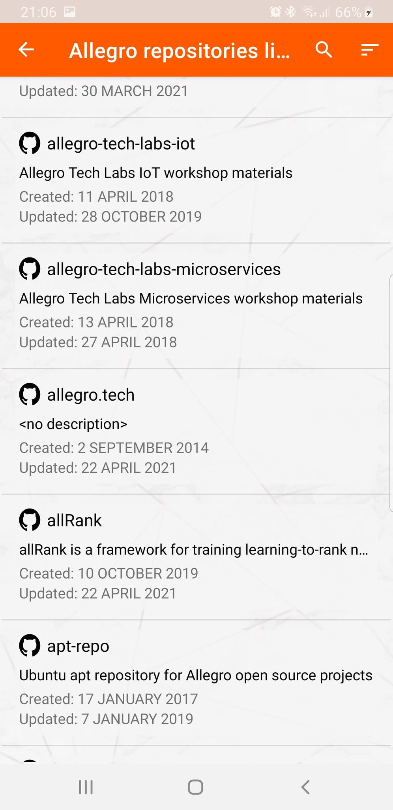
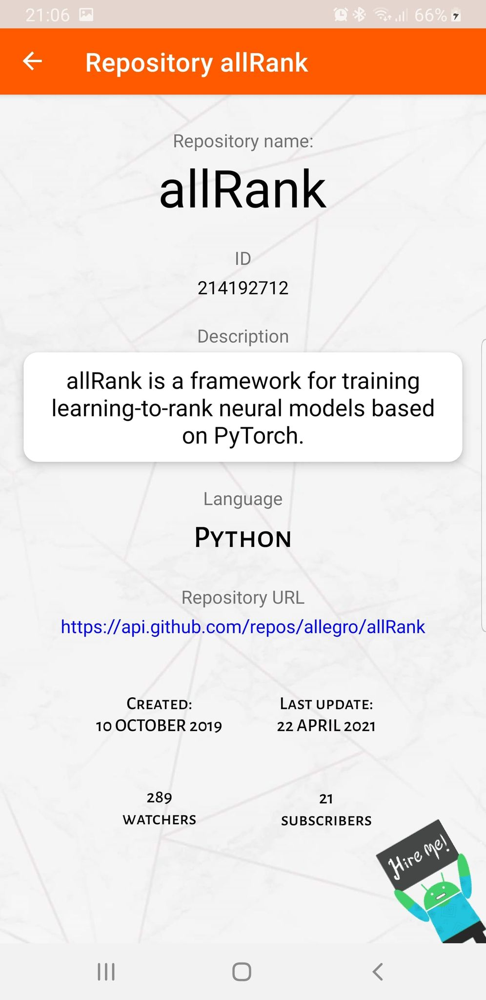

<h1 align="center">Repositories Display with the use of MVVM architecture</h1>

## Using the application

####  Application displays all Github repositories of given user. Implemented in full MVVM Architecture with the use of Kotlin language.

**.apk** file is in root project directory named **application.apk**. To use it with AndroidStudio emulator just drag .apk file on Emulator window.

Application consists of three screens - welcome screen, repositories list screen and repository details.

On the welcome screen user must provide github user name which repositories will be displayed on the repositories list screen.
On the repositories list screen clicking any object from the list will show the selected repository details.

--------------------------------------------------

## Used MVVM architecture components

- **Dependency injection** withe the use of **Dagger Hilt** which provides a standard way to incorporate dependency injection into an Android application. I used Dagger Hilt instead of Dagger because of the simplicity - Hilt works by code generating your Dagger setup code for you. This takes away most of the boilerplate of using Dagger.

- **LiveData** - core of MVVM architecture - is an observable data holder class that is lifecycle-aware. It allows to communicate between different parts of application without compromising data.
- **Coroutines** - design pattern that you can use on Android to simplify code that executes asynchronously. Coroutines help to manage long-running tasks that might otherwise block the main thread - like API calls.
-  **Retrofit** - is a REST Client for Android which makes communicating with API service easier. 
- **GSON** - helps with converting JSON string into data objects
- **Local database with caching system** with the use of **Room** Library. The Room persistence library provides an abstraction layer over SQLite to allow for more robust database access. Implemented caching system that detects data changes minimizing the amount of API calls.

- **Android navigation component**.

### Additional features
- **Basic Tests** - Room and search/sort function unit tests.
- **Network connection check** - using LiveData, application is constantly monitoring the network status. In case of disconnection the proper warning will be displayed. Thanks to the use of the caching data application is usable without the network connection
- **Filtering by repository name**.
- **Sorting by name/date of creation/last update date**.
- **Animations and fluid transitions between screens**
- **Hyperlinks** from repository details to Github and welcome screen text with introduction links to my Linkedin profile.
- **Views optimized for horizontal displays**

